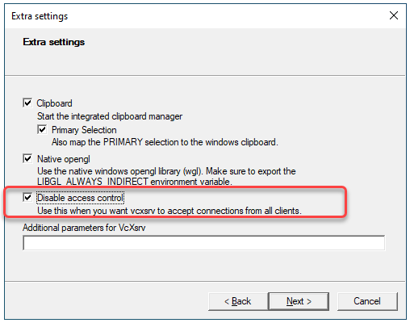

# Guide: How to compile on Windows using WSL

This guide shows how to compile the *Online LiDAR Processor (OLP)* on Windows using *Windows Subsystem for Linux (WSL)*.  
Tested on Windows 10 running Ubuntu Focal (20.04 LTS) on WSL2.

## Get WSL

For a detailed guide, see the official [Windows Subsystem for Linux Installation Guide for Windows 10](https://docs.microsoft.com/en-us/windows/wsl/install-win10) page on Microsoft Docs.

*Disclaimer:* This walkthrough is fork WSL2. Some steps might differ for WSL1.

## Compile the program

For instructions on setting up your project on Ubuntu, see [Guide: How to compile on Ubuntu](INSTALL_UBUNTU.md).

## Visualization with XServer

WSL by itself only comes with a terminal, to run graphical applications, an XServer must be set up.

1. Download and install [VcXsrv](https://sourceforge.net/projects/vcxsrv/).

2. Start VcXsrv, on the first run the firewall rules will be created. Allow network traffic both on private and public networks.
When launching VcXsrv select **Multiple windows**, then **Start no client**, then check **Disable access control** before finally starting.  


3. Modify your `~/.bashrc` file to redirect display.
```bash
export DISPLAY=$(awk '/nameserver / {print $2; exit}' /etc/resolv.conf 2>/dev/null):0
export LIBGL_ALWAYS_INDIRECT=1
```

### Test XServer
To test if the X-server is set up properly, you can install and try to start a graphical application on your WSL Ubuntu terminal. *Example:*

```bash
sudo apt install x11-apps
xeyes
```

### Typical issues
 * **Issue:** you get the *Authorization required, but no authorization protocol specified* error message when executing *OLP*.  
 **Solution:** the **Disable access control** option was not checked when launching VcXsrv.

 * **Issue:** runtime error when executing *OLP*, referring that your graphics driver does not support some OpenGL function.  
 **Solution:** uncheck the **Native opengl** option when starting VcXsrv. Also, set the `LIBGL_ALWAYS_INDIRECT` variable to `0` in `~/.bashrc` in the virtual machine.

### Secure network access to XServer

Open **Windows Defender Firewall / Advanced settings**, then on the **Inbound Rules** tab, disable the `VcXsrv windows server` block rule for public networks. Instead, add a new inbound rule to allow `TCP port 6000` through. To restrict this new rule to only allow WSL subnet traffic, go to its properties, under the *Scope* tab set **Remote IP address** to **These IP addresses** and add `172.16.0.0/12`.


## Development

### Sharing files between Windows and WSL

Access points to your drives on WSL are located in the `/mnt/` folder, as such you can access the drive labelled `C` at `/mnt/c`. To avoid file corruptions it is recommended not to edit files used by your WSL system directly from Windows.

### Using Windows dev tools in WSL

**Visual Studio Code** installed on your Windows system can be directly called from WSL on your current working (or other) directory after installing the **Remote - WSL** extension:
```bash
code .
```
To compile and debug *OLP* in **Visual Studio Code** install the **CMake** and **CMake Tools** extensions.

*Note:* this uses the Ninja build system by default, set to Linux make by adding `"cmake.generator": "Unix Makefiles"` to your `settings.json` file.